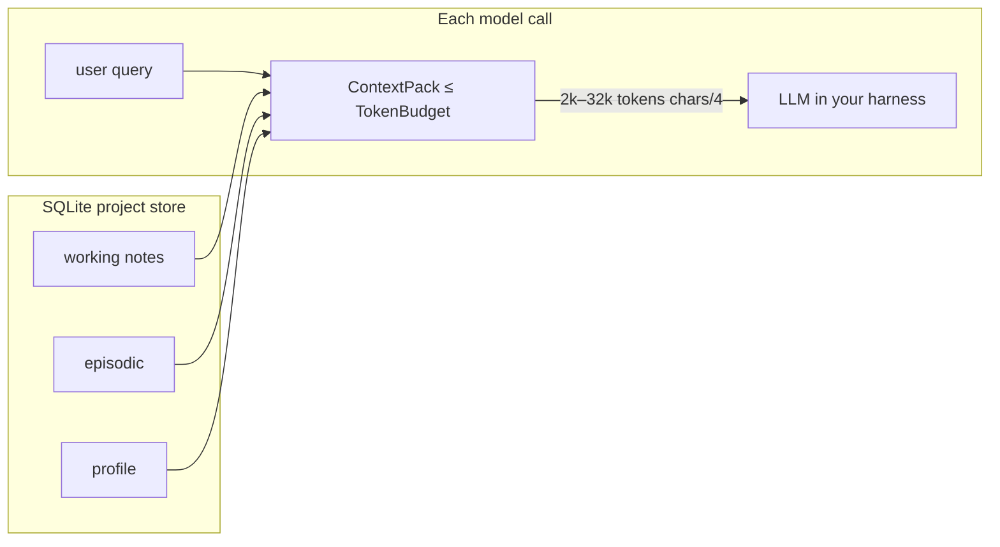
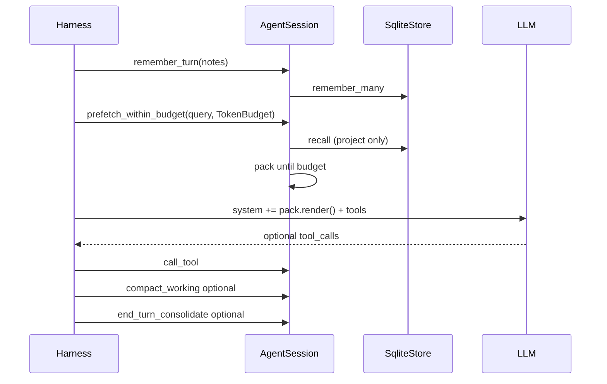
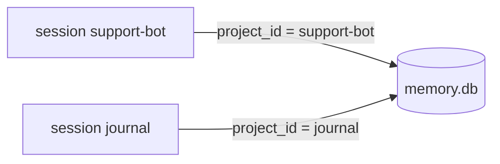

# Architecture

English. 中文：[ARCHITECTURE.zh-CN.md](ARCHITECTURE.zh-CN.md) · Usage: [USAGE.md](USAGE.md) · dsh install: [INSTALL_DSH.md](INSTALL_DSH.md)

`ai-memory` sits **under** the harness. You keep the model and the tool loop. This crate keeps project-scoped memory and builds a **token-budgeted** pack for the next call.

It is not a full LLM harness (no DeepSeek/Claude/Codex client, no network loop).

## Scenario → call → get

| You have | You call | You get |
|----------|----------|---------|
| A support bot that must remember prefs | `remember` profile + `prefetch_within_budget` | Ranked, cited lines in `ContextPack.render()` |
| Many tickets in **one** session, chat bigger than the model (~1M or less) | Persist turns; pack with `TokenBudget` (2k–32k) | A prompt slice that fits; the rest stays in SQLite |
| Two products, no leaks | Two `project` ids / two `AgentSession`s | `WHERE project_id = ?` |
| Working notes piling up | `compact_working` (explicit) | Pinned + newest kept; older working folded to one episodic note |
| TTL / promotions | `end_turn_consolidate` (explicit) | Deletes expired unpinned; working→episodic→profile |

**Do not** dump the transcript into the model. **Do** store + budgeted pack.

## The ~1M-token session



The store can grow without bound. The **prompt cannot**. Default estimator is `ceil(chars/4)`. Pins and high hybrid scores fill the budget first; oversized lines are truncated.

`compact_working` is extractive and offline (not an LLM summarizer). `consolidate` is still a separate, explicit call.

## One turn



## Isolation

One `.db` file, many projects. Sessions never share recall.



## Transparent performance

`open()` applies WAL, `synchronous=NORMAL`, foreign keys, `temp_store=MEMORY`, ~16 MiB cache, 5s busy timeout, prepared statements, embed LRU, recall prune (`scan_limit` 2048, `candidate_prune` 256). Sessions inherit that store.

Not automatic: `consolidate`, `compact_working`, policy writes, network embedders.

```bash
cargo bench
cargo run --example harness_loop_sim
```

## What this crate is not

- Not a replacement for pi / Claude / Codex / DeepSeek harnesses
- Not a way to fit 1M tokens into one prompt
- Not cloud sync or a custom database engine
- Optional napi / CLI host for DeepSeek Harness: [INTEGRATION_DSH.md](INTEGRATION_DSH.md)
