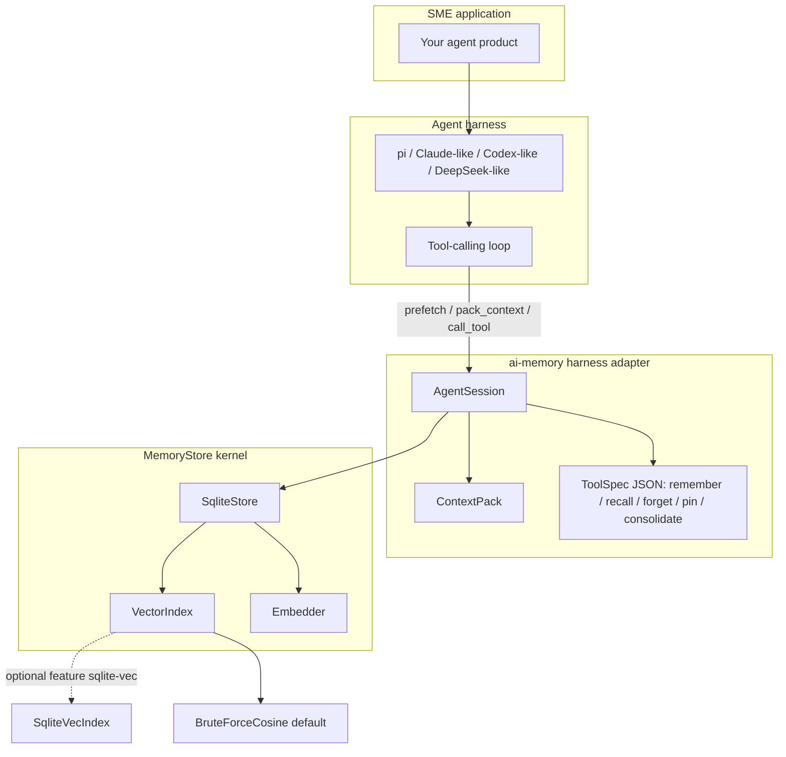
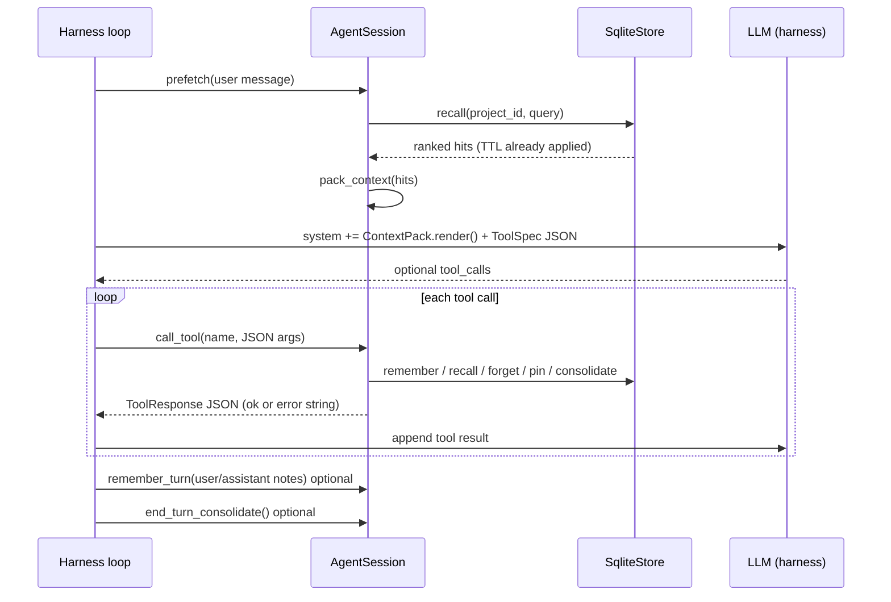
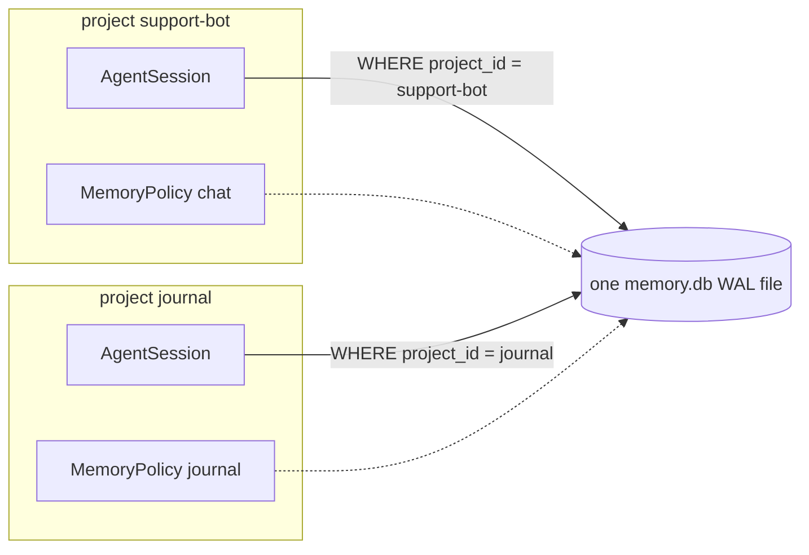
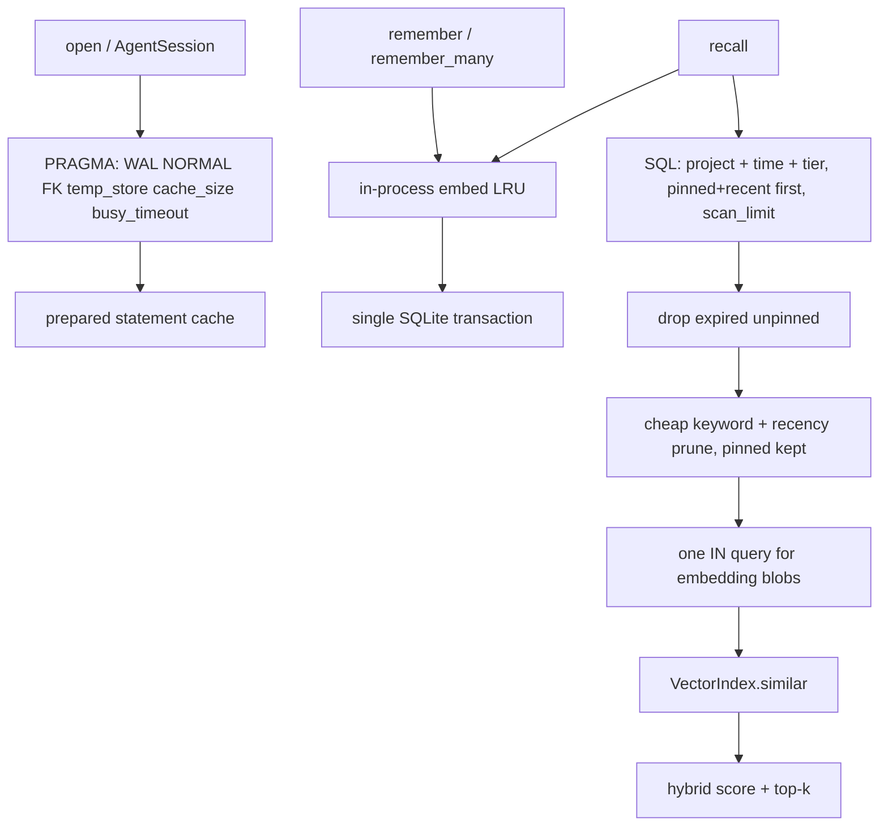

# Architecture

English. 中文：[ARCHITECTURE.zh-CN.md](ARCHITECTURE.zh-CN.md)

`ai-memory` is the **embedded memory / data layer** under an agent harness. It is **not** a full LLM harness: no model client, no DeepSeek/Claude/Codex SDK, no network loop. Products such as [earendil-works/pi](https://github.com/earendil-works/pi) (unified LLM API + agent loop + tools), or similar Claude / Codex / DeepSeek-style harnesses, own the model turn. This crate owns **project-scoped memory**, **hybrid recall**, and a **thin JSON tool adapter**.

See also [USAGE.md](USAGE.md).

## 1. Stack layers



One **Rust + SQLite** kernel for every project. Isolation is `project_id` + `MemoryPolicy`, not extra engines. A future Lance backend would implement `MemoryStore` the same way.

## 2. Single agent turn



**Before the model call:** `prefetch` + `ContextPack` so the model sees cited `id` / `tier` / `score`.  
**During tools:** JSON names `memory_remember`, `memory_recall`, `memory_forget`, `memory_pin`, `memory_consolidate`.  
**After the turn:** optional `remember_many` / `end_turn_consolidate`.

## 3. Multi-project isolation



Several agents or products share one file. Recall, pin, forget, and tool dispatch always take the session's `project_id`. Guessing another project's memory id does not leak text through `recall`.

## 4. Performance path



Details: [Transparent performance](#5-transparent-performance--what-you-get-for-free).

## 5. Transparent performance — what you get for free

SME engineers wiring pi / Claude-like / Codex-like harnesses should not tune a jungle of knobs. `open("./memory.db")` and `store.session("project")` already apply the fast path.

**You get for free (no extra API):**

| Default | What it does |
|---------|----------------|
| WAL + `synchronous=NORMAL` | File stores; crash-safe enough for a local agent DB |
| `busy_timeout` 5s | Wait on a locked file instead of failing immediately |
| `foreign_keys=ON` | Project delete cascades memories + embeddings |
| `temp_store=MEMORY` | Sort/temp tables stay in RAM |
| `cache_size` ≈ 16 MiB | Page cache (`PRAGMA cache_size=-16384`) |
| Statement cache | Hot `remember` / `recall` / `get` reuse prepared SQL |
| Embed LRU (2048) | Same text + embedder dim is not re-hashed in this process. Bytes may be shared across projects; each `remember` still writes its own memory row |
| `scan_limit` 2048 | Recall scans pinned then recent rows first |
| `candidate_prune` 256 | Cheap keyword + recency cut before vector scoring; pinned rows are kept |
| `RecallQuery` limit 8 | Naive `recall("...")` stays a small top-k |
| Single-writer mutex | In-process `Mutex<Connection>` — one writer in this process |

Inspect with `store.applied_pragmas()`. Sessions inherit the same store (same PRAGMAs, same embed cache): `store.session("support-bot")` or `AgentSession::attach`.

**Fast write path you should still choose:** `remember_many` / `AgentSession::remember_turn` for a turn’s notes (one transaction). Single `remember` already uses that same transaction helper for one item — API unchanged.

**What you must still call:** `consolidate` (or `end_turn_consolidate` / the `memory_consolidate` tool). This crate **does not** run consolidate in the background. TTL already hides expired unpinned rows from recall; consolidate is what deletes them and promotes tiers. Call it when you mean to — typically end of turn or a cron you own.

**Not done here (on purpose):** silent policy mutation, network embedders as default, auto-consolidate, turning the crate into an LLM harness.

Microbenchmarks (not part of `cargo test`):

```bash
cargo bench
```

See `benches/memory_hot_path.rs` (single remember, batch vs loop, recall on a populated store).

## Wiring into a generic tool-calling loop

No vendor SDK. Register JSON schemas, then drive the turn:

```rust
use ai_memory::{memory_tool_specs, SqliteStore};

let store = SqliteStore::open("./memory.db")?;
store.create_project("support-bot", ai_memory::MemoryPolicy::chat())?;
let session = store.session("support-bot")?;

// 1. Give these to pi / Claude / Codex / DeepSeek-style harnesses
let tools = memory_tool_specs();
let _openai = tools.iter().map(|t| t.openai_tool()).collect::<Vec<_>>();
let _anthropic = tools.iter().map(|t| t.anthropic_tool()).collect::<Vec<_>>();

// 2. Before the model: recall + pack
let hits = session.prefetch("user question")?;
let system_memory = session.pack_context(&hits).render();

// 3. When the model emits a tool call:
let result = session.call_tool("memory_recall", serde_json::json!({"text": "theme"}));
// result.ok / result.data / result.error — feed JSON back into the loop

// 4. After the turn
session.end_turn_consolidate()?;
```

Run the fake loop:

```bash
cargo run --example harness_loop_sim
```

## What this crate is not

- Not a replacement for pi / Claude / Codex / DeepSeek harnesses
- Not a cloud sync or multi-tenant server
- Not FFI language bindings (yet)
- Not a custom database engine
