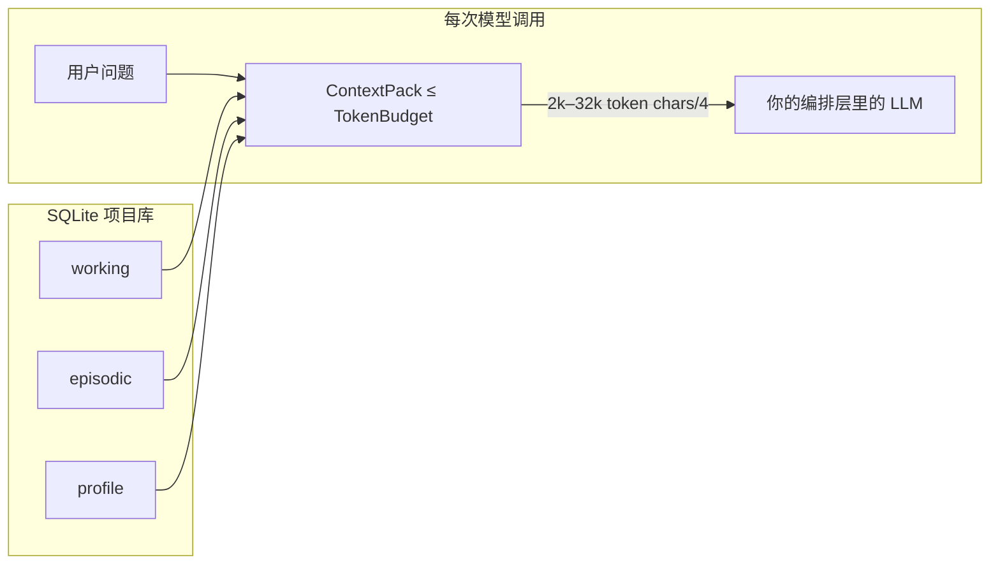
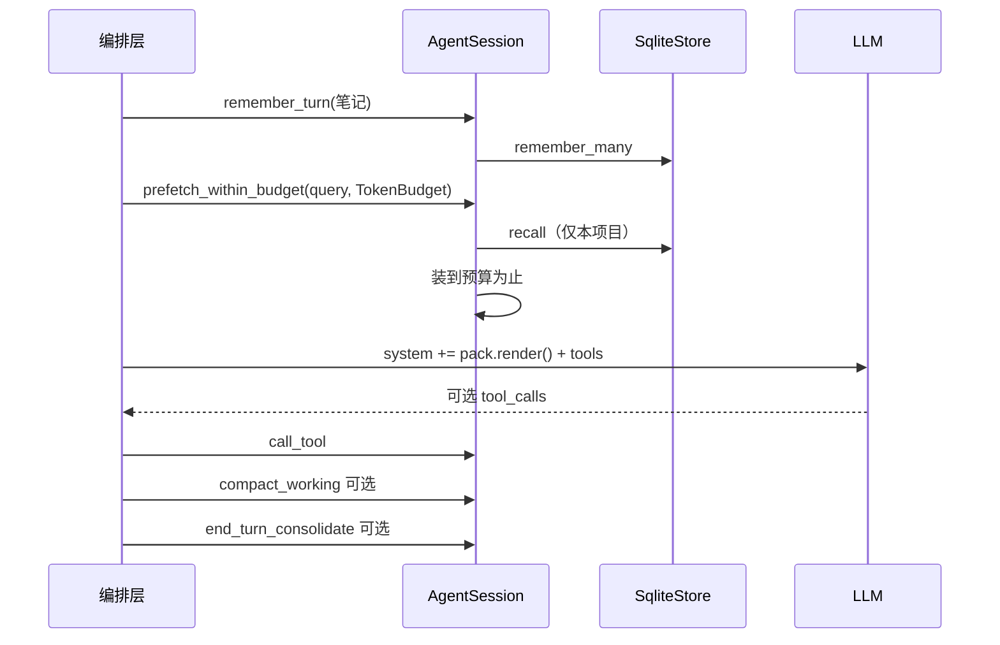
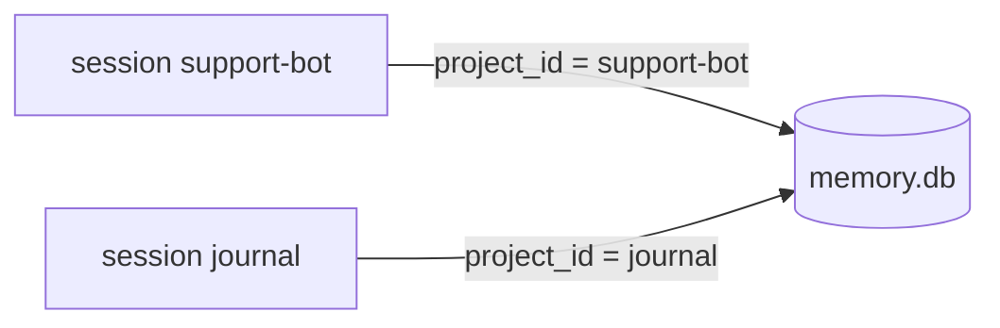

# 架构

中文。[English](ARCHITECTURE.md) · 用法：[USAGE.zh-CN.md](USAGE.zh-CN.md)

`ai-memory` 在编排层**下面**。模型和工具循环归你。本库按项目存记忆，并为下一轮模型调用打出 **有 token 预算** 的 pack。

它不是完整 LLM harness（没有 DeepSeek/Claude/Codex 客户端，没有联网循环）。

## 场景 → 调用 → 得到什么

| 你遇到的情况 | 调用 | 得到 |
|--------------|------|------|
| 客服机器人要记住偏好 | `remember` profile + `prefetch_within_budget` | `ContextPack.render()` 里带 id/层级/分数的几行 |
| **同一个** session 里很多工单，聊天超过模型窗口（约 100 万或更小） | 每轮写入；用 `TokenBudget`（2k–32k）打包 | 一段塞得进 prompt 的切片；其余留在 SQLite |
| 两个产品互不泄漏 | 两个 `project` / 两个 `AgentSession` | `WHERE project_id = ?` |
| working 笔记堆起来 | 显式 `compact_working` | 留下 pin + 最新；旧 working 折成一条 episodic |
| TTL / 晋升 | 显式 `end_turn_consolidate` | 删除过期未 pin；working→episodic→profile |

**不要**把完整 transcript 塞进模型。**要**先存储，再按预算打包。

## 约 100 万 token 的长 session



库可以一直变大。**prompt 不能。** 默认按 `ceil(字符数/4)` 估 token。先装 pin 和高分；超长行会截断。

`compact_working` 是离线抽取，不是 LLM 摘要。`consolidate` 仍然要单独、显式调用。

## 单回合



## 隔离

一个 `.db`，多个项目。session 之间召回不共享。



## 透明性能

`open()` 会套上 WAL、`synchronous=NORMAL`、外键、`temp_store=MEMORY`、约 16 MiB 缓存、5 秒 busy_timeout、预编译语句、embed LRU、召回剪枝（`scan_limit` 2048，`candidate_prune` 256）。session 继承同一个 store。

不会自动做：`consolidate`、`compact_working`、改政策、默认走网络 Embedding。

```bash
cargo bench
cargo run --example harness_loop_sim
```

## 本库明确不做

- 不替代 pi / Claude / Codex / DeepSeek 编排层
- 不能把 100 万 token 塞进一次 prompt
- 不是云同步、FFI，也不自研存储引擎
