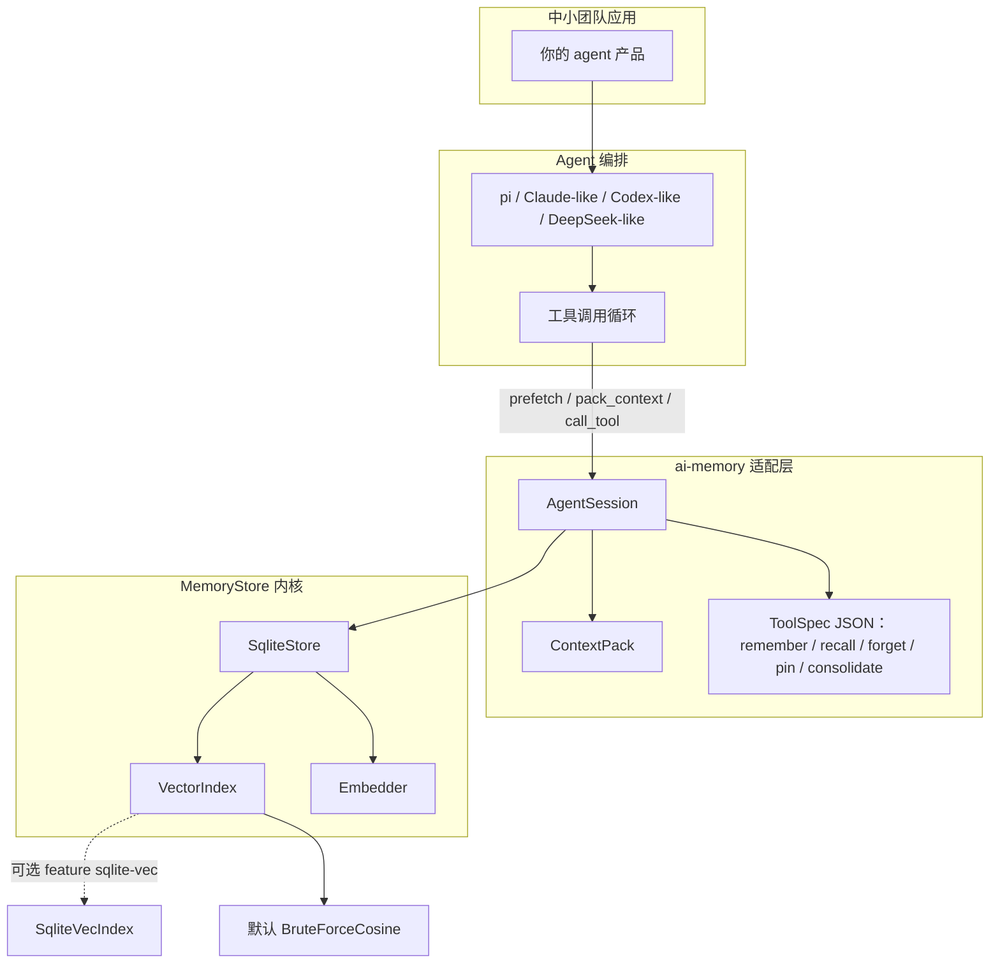
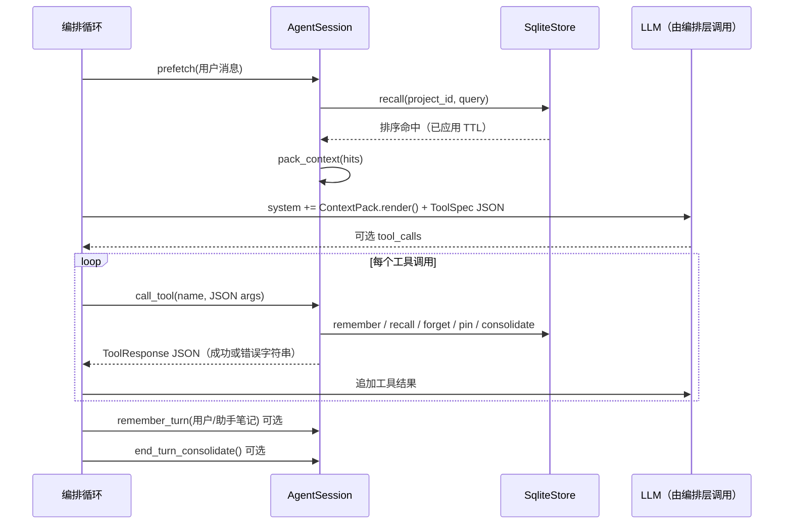
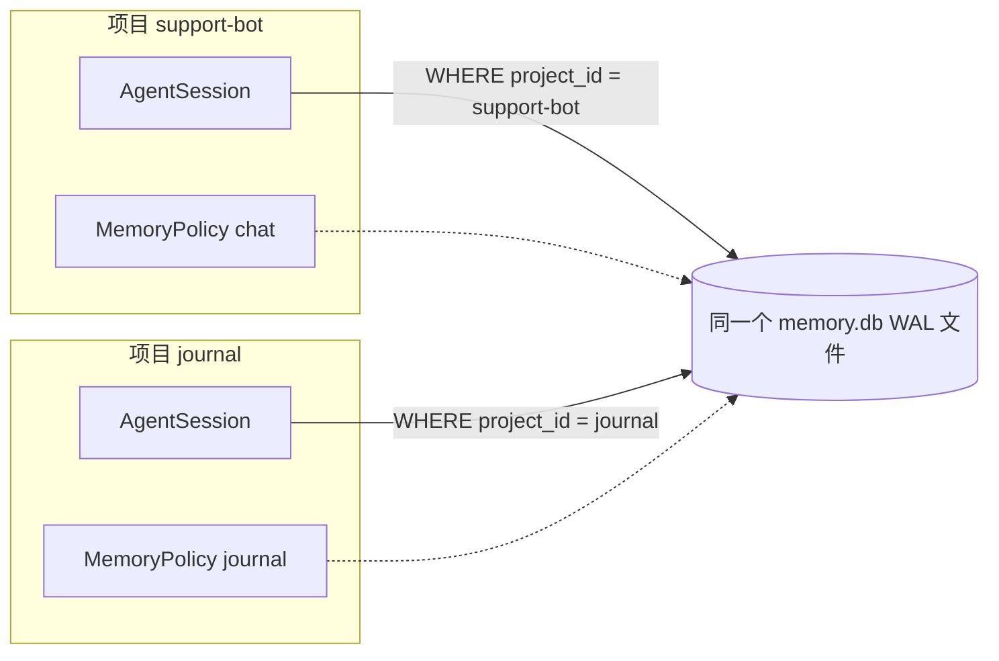
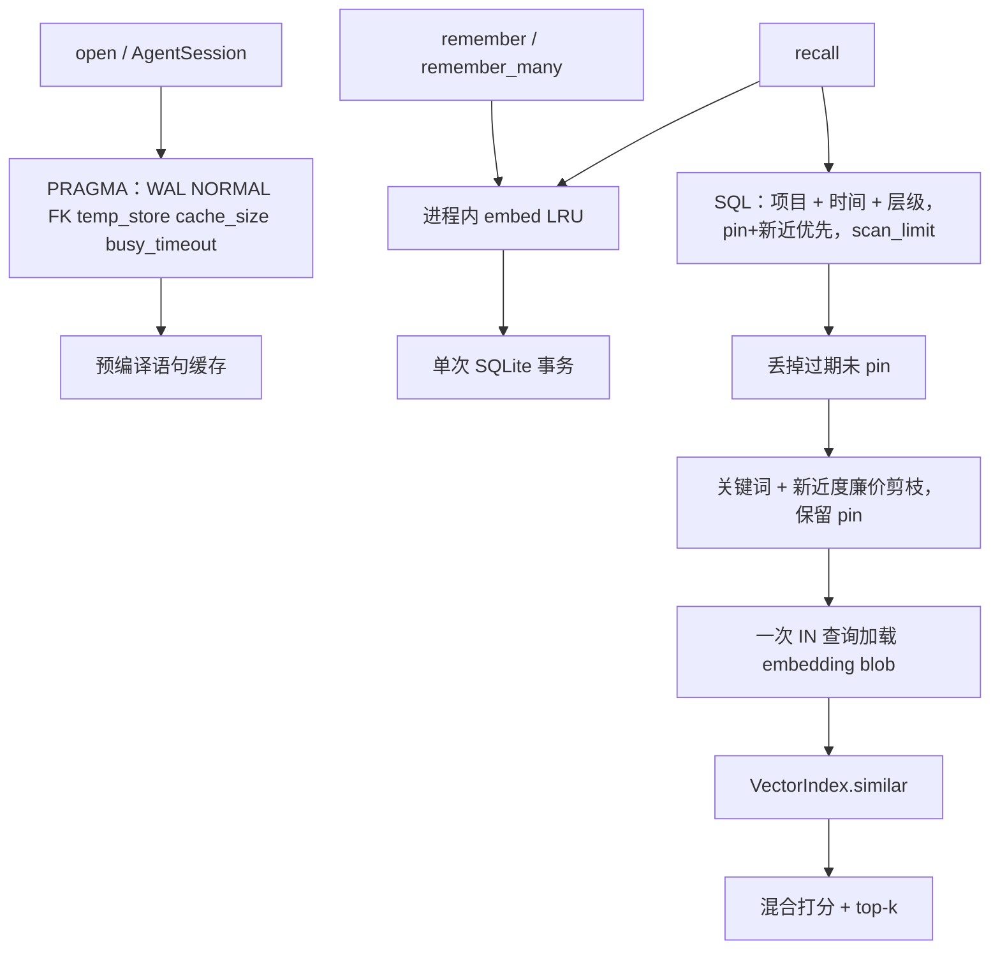

# 架构

中文。English：[ARCHITECTURE.md](ARCHITECTURE.md)

`ai-memory` 是 agent 编排层下面的**嵌入式记忆 / 数据层**。它**不是**完整的 LLM harness：没有模型客户端、没有 DeepSeek/Claude/Codex SDK、没有联网循环。[earendil-works/pi](https://github.com/earendil-works/pi)（统一 LLM API + agent 循环 + 工具）以及类似的 Claude / Codex / DeepSeek 风格编排层负责模型回合。本库负责 **按项目隔离的记忆**、**混合召回**，以及一层 **JSON 工具适配**。

另见 [USAGE.zh-CN.md](USAGE.zh-CN.md)。

## 1. 分层



所有项目共用一套 **Rust + SQLite** 内核。隔离靠 `project_id` + `MemoryPolicy`，不是换引擎。未来 Lance 同样实现 `MemoryStore` 即可。

## 2. 单次 agent 回合



**模型调用前：** `prefetch` + `ContextPack`，带上 `id` / `tier` / `score`。  
**工具阶段：** `memory_remember`、`memory_recall`、`memory_forget`、`memory_pin`、`memory_consolidate`。  
**回合结束后：** 可选 `remember_many` / `end_turn_consolidate`。

## 3. 多项目隔离



多个 agent / 产品共用一个文件。召回、pin、forget、工具分发都带上 session 的 `project_id`。用别人的 memory id 去 `recall` 也拿不到对方文本。

## 4. 性能路径



细节见 [透明性能](#5-透明性能你免费得到什么)。

## 5. 透明性能：你免费得到什么

给中小团队接 pi / Claude-like / Codex-like 编排时，性能应尽量看不见。调用 `open("./memory.db")` 和 `store.session("project")` 就已经走快路径，不必调一堆旋钮。

**免费得到（不用另调 API）：**

| 默认 | 作用 |
|------|------|
| WAL + `synchronous=NORMAL` | 文件库；本地 agent 库足够安全 |
| `busy_timeout` 5s | 文件被锁时等待，而不是立刻失败 |
| `foreign_keys=ON` | 删项目时级联记忆和向量 |
| `temp_store=MEMORY` | 排序/临时表在内存 |
| `cache_size` ≈ 16 MiB | 页缓存（`PRAGMA cache_size=-16384`） |
| 语句缓存 | 热路径 `remember` / `recall` / `get` 复用预编译 SQL |
| Embed LRU（2048） | 同一进程里相同文本 + embedding 维度不重复哈希。向量字节可跨项目共享；每次 `remember` 仍写自己的记忆行 |
| `scan_limit` 2048 | 召回先扫 pin，再扫新近行 |
| `candidate_prune` 256 | 向量打分前按关键词 + 新近度裁剪；pin 行保留 |
| `RecallQuery` limit 8 | 直接 `recall("...")` 也只取一小段 top-k |
| 进程内单写者 | `Mutex<Connection>` |

用 `store.applied_pragmas()` 查看。Session 继承同一个 store（同一套 PRAGMA、同一份 embed 缓存）：`store.session("support-bot")` 或 `AgentSession::attach`。

**写入快路径请主动用：** 一轮笔记用 `remember_many` / `AgentSession::remember_turn`（一个事务）。单条 `remember` 已经走同一套事务辅助，API 不变。

**你仍须自己调用：** `consolidate`（或 `end_turn_consolidate` / `memory_consolidate` 工具）。本库**不会**在后台自动 consolidate。TTL 已让过期未 pin 行从召回中消失；consolidate 负责真正删除并晋升层级。在你想做的时候调用——通常是回合结束，或你自己的定时任务。

**明确不做：** 静默改政策、默认走网络 Embedding、自动 consolidate、把本库做成 LLM harness。

微基准（**不**在默认 `cargo test` 里）：

```bash
cargo bench
```

见 `benches/memory_hot_path.rs`（单条 remember、批量 vs 循环、已填充库上的 recall）。

## 接到通用 tool-calling 循环

不绑厂商 SDK。注册 JSON Schema，然后按回合驱动：

```rust
use ai_memory::{memory_tool_specs, SqliteStore};

let store = SqliteStore::open("./memory.db")?;
store.create_project("support-bot", ai_memory::MemoryPolicy::chat())?;
let session = store.session("support-bot")?;

let tools = memory_tool_specs();
let _openai = tools.iter().map(|t| t.openai_tool()).collect::<Vec<_>>();
let _anthropic = tools.iter().map(|t| t.anthropic_tool()).collect::<Vec<_>>();

let hits = session.prefetch("用户问题")?;
let system_memory = session.pack_context(&hits).render();

let result = session.call_tool("memory_recall", serde_json::json!({"text": "主题"}));

session.end_turn_consolidate()?;
```

模拟循环：

```bash
cargo run --example harness_loop_sim
```

## 本库明确不做

- 不替代 pi / Claude / Codex / DeepSeek 编排层
- 不是云同步或多租户服务
- 暂无 FFI 语言绑定
- 不自研存储引擎
