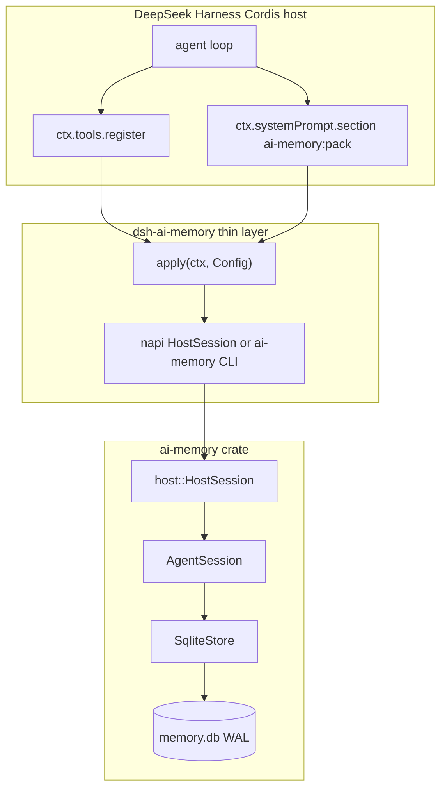

# DeepSeek Harness integration (endorsement)

English. 中文：[INTEGRATION_DSH.zh-CN.md](INTEGRATION_DSH.zh-CN.md) · Usage: [USAGE.md](USAGE.md) · Architecture: [ARCHITECTURE.md](ARCHITECTURE.md)

**DeepSeek Harness (dsh)** is the intended **consumer / showcase** for `ai-memory`. This document is the citeable integration story: why the crate sits *under* dsh, how the thin Cordis plugin is installed, and how that differs from the crowded “Memory plugin” category.

**Flagship demo:** [scenarios/dsh-support-agent/](../scenarios/dsh-support-agent/) — one long support / ops session (sidebar bug + billing + follow-ups). Headless sim drives the Cordis plugin without the dsh Web UI.

It is **not** an official DeepSeek App Store listing and **not** a rewrite of memory in JavaScript.

## Why ai-memory under dsh

dsh already owns the model loop, tool registry, and system-prompt assembly. `ai-memory` owns project-scoped storage and a **token-budgeted** pack for the next call. That split is the product:

| dsh keeps | This crate keeps |
|-----------|------------------|
| LLM client, agent loop, `ctx.tools`, `ctx.systemPrompt` | `SqliteStore`, `MemoryPolicy`, hybrid recall |
| Plugin load / profile composition | `prefetch_within_budget` + `ContextPack.render()` |
| UI, permissions, marketplace later | Explicit `compact_working` / `consolidate` |

You do **not** stuff a ~1M-token transcript into the prompt. You persist turns, then pack 2k–32k tokens (`ceil(chars/4)` by default). Pins and high hybrid scores fill the budget first.

### Project + MemoryPolicy

Isolation is `project_id`. One `.db` file, many projects; recall cannot leak. Create a project with `MemoryPolicy::chat()`, `journal()`, or `default()` (working TTL, promote delays, recall mix). The plugin’s `projectId` / `policy` config is that same knob.

### prefetch_within_budget

Before each model call the host asks for a pack that **fits**. Oversized lines are truncated; the store can grow without bound. The prompt cannot.

### Transparent performance

`open()` already applies WAL, `synchronous=NORMAL`, foreign keys, `temp_store=MEMORY`, ~16 MiB cache, 5s busy timeout, statement cache, embed LRU, and recall prune (`scan_limit` 2048, `candidate_prune` 256). Sessions inherit that store. No extra “make it fast” API.

### Explicit compact / consolidate

Nothing runs in the background. `memory_compact` folds older unpinned working notes into one **extractive** episodic row (offline; not an LLM summarizer). `memory_consolidate` applies TTL delete + working→episodic→profile. You call them on purpose.

## How this is not a me-too Memory plugin

The Memory category is crowded with plugins that **auto-extract** facts with an extra LLM call, silently write a vector store, and inject an unbounded “memory block.” That is not the pitch here.

| Typical Memory plugin | ai-memory + dsh |
|----------------------|-----------------|
| Auto LLM extraction / silent consolidate | Tools + explicit compact/consolidate |
| JS/Python reimplementation of memory | Rust crate is the source of truth |
| “Supports 1M-token prompts” | Stores the long session; packs a slice |
| Cross-chat global bag of facts | `project_id` isolation |
| Hidden perf knobs | Transparent SQLite defaults on `open()` |

dsh may grow its own extraction features. This integration **does not depend** on them. The model may call `memory_remember`; the crate will not call the model for you.

## Architecture



Installable bundle contract (official publish tutorial):

- `package.json` → `dsh.bundle.patch` → `./cordis.patch.yml`
- Patch row `name: dsh-ai-memory` (installed package name, not a relative path)
- Module exports `name`, `inject`, `apply(ctx)`, and a Schemastery `Config` when `@deepseek-ai/schemastery` is present

## Flagship usage scenario

A mid-size company **support / ops agent** keeps *one* long dsh session across related tickets. The chat would exceed a ~1M (or smaller) model window if you dumped history. The agent persists turns with `memory_remember` and injects `prefetch_within_budget` via the Cordis `ai-memory:pack` section.

| | |
|--|--|
| Package | [`scenarios/dsh-support-agent/`](../scenarios/dsh-support-agent/) ([中文](../scenarios/dsh-support-agent/README.zh-CN.md)) |
| Seed | `T-1042` sidebar overlap, `T-1088` duplicate invoice, pin `PINNED-BILLING-OWNER-ADA`, project `sme-hr` isolation |
| Headless (CI / no dsh UI) | `node scenarios/dsh-support-agent/sim/run.mjs` — fake `ctx`, same `apply(ctx)` as the plugin |
| Rust smoke | `cargo test --test dsh_support_scenario` |
| Real dsh | `dsh plugin add` then play the seed; look for `## Memory (project: sme-support, …)` — not the full transcript |

Observe: pack `tokens` stay under the budget; the pin survives a tight pack; `sme-hr` does not leak T-1042. Publishing to dsh.pub is still a later step.

## Install path

Package: [`integrations/dsh-ai-memory/`](../integrations/dsh-ai-memory/) (`dsh-ai-memory` on npm-compatible installs).

```bash
# from a repo checkout
dsh plugin --profile demo add ./integrations/dsh-ai-memory
dsh --profile demo --dump-config    # "# == dsh-ai-memory"
```

Git (subdirectory of this repo). pnpm ≥10 will refuse `prepare` until you allow the build — `prepare` compiles Rust (napi + CLI). Official dsh docs: copy the package key into the profile `pnpm-workspace.yaml` and re-run `add`:

```yaml
allowBuilds:
  dsh-ai-memory: true
```

```bash
dsh plugin --profile demo add github:zzjzzb/ai-memory#path:integrations/dsh-ai-memory
```

Pin a commit (`github:zzjzzb/ai-memory#<sha>:path:integrations/dsh-ai-memory`) so a later push cannot change install-time code.

**Discovery (optional, later):** add the GitHub topic `dsh-plugin`. Submit to [dsh.pub](https://dsh.pub/en/submit/) only when you want a catalog row. dsh.pub’s first-version flow prefers a bundle at the **repository root**; this subdirectory is the in-repo showcase, not a claimed App Store listing.

## Binding strategy

The plugin must use this crate. Tradeoffs:

| Bridge | Cost | When |
|--------|------|------|
| **napi-rs** (`integrations/dsh-ai-memory/native`) | In-process; needs `cargo` + a `prepare` allowlist on git install | Preferred. Exposes `HostSession.open` / `dispatch` (remember, recall, budgeted pack, compact, consolidate). |
| **`ai-memory` CLI** | One process per call; same JSON envelope | MVP fallback if the `.node` addon does not load. Clear TODO: replace with napi-only once prebuilds exist. |
| TypeScript store | — | **Out of scope.** Do not fake hybrid recall or packing in JS. |

`HostSession` (`src/host.rs`) is the stable host API. The CLI and the napi addon are thin wrappers. `cargo test` covers the host + CLI; the napi crate has a Rust smoke test; the plugin has Node tests for config / arg mapping / bundle manifest.

## Config

| Field | Default | Role |
|-------|---------|------|
| `dbPath` | `~/.local/share/ai-memory/dsh.db` | SQLite path (`AI_MEMORY_DB` overrides empty) |
| `projectId` | `dsh` | Project isolation |
| `tokenBudget` | `8192` | Pack cap |
| `policy` | `chat` | Used only when the project is created |
| `prefetchEnabled` | `true` | Inject budgeted pack into the system prompt |
| `sectionOrder` | `40` | `PromptSection.order` (after persona, before typical tool guidance) |

## Verify

```bash
cargo test
cd integrations/dsh-ai-memory && DSH_AI_MEMORY_SKIP_NATIVE=1 npm test
# after Rust/node toolchains:
npm run prepare   # in integrations/dsh-ai-memory
cargo build --bin ai-memory
npm test --prefix scenarios/dsh-support-agent
node scenarios/dsh-support-agent/sim/run.mjs
```

Manual: `dsh plugin add` as above, then `memory_remember` and confirm a `## Memory (project: …)` section on the next model call.

## What we will not claim

- Official DeepSeek endorsement or App Store listing
- Auto-LLM memory extraction as the default
- That this crate replaces dsh
- That 1M tokens fit in one prompt
