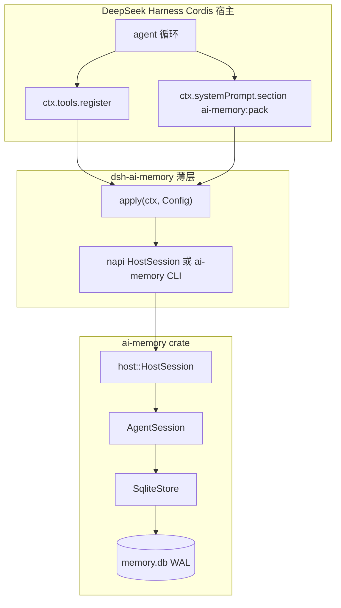

# DeepSeek Harness 集成（背书说明）

中文。[English](INTEGRATION_DSH.md) · 用法：[USAGE.zh-CN.md](USAGE.zh-CN.md) · 架构：[ARCHITECTURE.zh-CN.md](ARCHITECTURE.zh-CN.md)

**5 分钟安装（复制命令）：** [INSTALL_DSH.zh-CN.md](INSTALL_DSH.zh-CN.md) · [English](INSTALL_DSH.md)

```bash
dsh plugin --profile web add github:zzjzzb/ai-memory#<commit>
dsh --profile web --dump-config    # 找 "# == dsh-ai-memory"
```

请钉死 `<commit>`（见安装指南）。第一次 git add 常常要给 `dsh-ai-memory` 写 `allowBuilds` —— 也在那份指南里。

**DeepSeek Harness（dsh）** 是 `ai-memory` 的目标 **消费方 / 展示面**。本文供他人引用：为什么本库放在 dsh **下面**、薄 Cordis 插件怎么装、以及它和扎堆的「Memory 插件」有何不同。

**旗舰演示：** [scenarios/dsh-support-agent/](../scenarios/dsh-support-agent/README.zh-CN.md) — 一条很长的支持 / 运维会话（侧栏 bug + 账单 + 后续）。无头模拟不需要 dsh 网页，直接驱动 Cordis 插件。

这不是官方 DeepSeek 应用商店上架，也不是用 JavaScript 重写记忆层。

## 为什么在 dsh 下面用 ai-memory

dsh 已经拥有模型循环、工具注册、系统提示拼装。`ai-memory` 负责按项目存储，并为下一轮调用打出 **有 token 预算** 的 pack。产品切分就是这一刀：

| dsh 保留 | 本库保留 |
|----------|----------|
| LLM 客户端、agent 循环、`ctx.tools`、`ctx.systemPrompt` | `SqliteStore`、`MemoryPolicy`、混合召回 |
| 插件加载 / profile 组合 | `prefetch_within_budget` + `ContextPack.render()` |
| UI、权限、以后的市场 | 显式 `compact_working` / `consolidate` |

**不要**把约 100 万 token 的 transcript 塞进 prompt。要先落盘，再打 2k–32k 的包（默认 `ceil(字符数/4)`）。先装 pin 和高混合分。

### 项目 + MemoryPolicy

隔离键是 `project_id`。一个 `.db`，多个项目；召回不会串。用 `MemoryPolicy::chat()` / `journal()` / `default()` 建项目（working TTL、晋升延迟、召回配比）。插件配置里的 `projectId` / `policy` 就是这组旋钮。

### prefetch_within_budget

每次模型调用前，host 只要一段 **塞得进** 的 pack。超长行会截断。库可以一直变大，**prompt 不能**。

### 透明性能

`open()` 已经套上 WAL、`synchronous=NORMAL`、外键、`temp_store=MEMORY`、约 16 MiB 缓存、5 秒 busy_timeout、语句缓存、embed LRU、召回剪枝（`scan_limit` 2048，`candidate_prune` 256）。session 继承同一个 store。没有另一套「再调优」API。

### 显式 compact / consolidate

后台不会自己跑。`memory_compact` 把较旧、未 pin 的 working 折成一条 **抽取式** episodic（离线，不是 LLM 摘要）。`memory_consolidate` 做 TTL 删除 + working→episodic→profile。你想做才调用。

## 这不是又一个 Memory 插件

Memory 分类很挤：多一次 LLM 自动抽事实、默默写向量库、再注入一段没有上限的「记忆块」。那不是这里的卖点。

| 常见 Memory 插件 | ai-memory + dsh |
|------------------|-----------------|
| 自动 LLM 抽取 / 静默 consolidate | 工具 + 显式 compact/consolidate |
| JS/Python 再实现一套记忆 | Rust crate 才是真相源 |
| 「支持 100 万 token prompt」 | 长 session 存在盘上；每次只打包切片 |
| 跨对话一个全局袋子 | `project_id` 隔离 |
| 隐藏性能旋钮 | `open()` 上的透明 SQLite 默认 |

dsh 以后也许会自带抽取。本集成 **不依赖** 那套。模型可以调 `memory_remember`；本库不会替你调模型。

## 架构



可安装 bundle 合同（官方发布教程）—— **仓库根目录**：

- 根目录 `package.json` → `dsh.bundle.patch` → `./cordis.patch.yml`
- 补丁行 `name: dsh-ai-memory`（已安装包名，不是相对路径）
- 模块（根目录 `index.js` 再导出 `integrations/dsh-ai-memory`）导出 `name`、`inject`、`apply(ctx)`；有 `@deepseek-ai/schemastery` 时再导出 `Config`

## 旗舰用法场景

中型公司的 **支持 / 运维代理** 用 *一条* 长 dsh 会话处理相关工单。若倒历史，聊天会超过约 100 万（或更小）的模型窗口。代理用 `memory_remember` 落盘，再通过 Cordis 的 `ai-memory:pack` 注入 `prefetch_within_budget`。

| | |
|--|--|
| 包 | [`scenarios/dsh-support-agent/`](../scenarios/dsh-support-agent/README.zh-CN.md)（[English](../scenarios/dsh-support-agent/README.md)） |
| 种子 | `T-1042` 侧栏重叠、`T-1088` 重复发票、pin `PINNED-BILLING-OWNER-ADA`、项目 `sme-hr` 隔离 |
| 无头（CI / 无 dsh UI） | `node scenarios/dsh-support-agent/sim/run.mjs` — 假 `ctx`，与插件同一套 `apply(ctx)` |
| Rust 冒烟 | `cargo test --test dsh_support_scenario` |
| 真机 dsh | [INSTALL_DSH.zh-CN.md](INSTALL_DSH.zh-CN.md)：`dsh plugin add github:zzjzzb/ai-memory#<commit>` 后把种子当用户句；看 `## Memory (project: sme-support, …)`，不是整段 transcript |

应看到：pack 的 `tokens` 不超过预算；紧预算下 pin 仍在；`sme-hr` 不泄漏 T-1042。提交 dsh.pub 仍是下一步。

## 安装路径

**用户请走 [INSTALL_DSH.zh-CN.md](INSTALL_DSH.zh-CN.md)**（前置条件、`allowBuilds`、验证、配置、故障排除）。

可安装组合包在 **仓库根目录**（`package.json` → `dsh.bundle.patch` → `./cordis.patch.yml`）。[`integrations/dsh-ai-memory/`](../integrations/dsh-ai-memory/) 里的 Cordis Host 由根目录 `index.js` 再导出。Rust `Cargo.toml` 仍是记忆的真相源。

```bash
# GitHub（推荐；钉 commit）
dsh plugin --profile web add github:zzjzzb/ai-memory#<commit>
dsh --profile web --dump-config    # "# == dsh-ai-memory"

# 仓库检出（同一套根组合包）
dsh plugin --profile web add .
```

git 安装会跑 **`prepare`**（napi + `ai-memory` CLI）。pnpm ≥10 会拒绝该脚本，直到你允许构建。按官方说明，把包名写进 profile 的 `pnpm-workspace.yaml` 再执行一次 `add`：

```yaml
allowBuilds:
  dsh-ai-memory: true
```

开发者仍可从 clone 里 `dsh plugin add ./integrations/dsh-ai-memory`。**不要**把 `github:zzjzzb/ai-memory#path:integrations/dsh-ai-memory` 当作用户安装路径 —— 子目录 git 拉取带不上 `prepare` 必须编译的 Rust crate。

**发现（可选、下一步）：** GitHub topic `dsh-plugin` 已经打上。只有你真要目录条目时，再到 [dsh.pub](https://dsh.pub/zh/submit/) 提交。dsh.pub 要求 **仓库根** 就是可安装组合包；现在就是本包。

## 绑定策略

插件必须走本 crate。取舍：

| 桥 | 代价 | 何时用 |
|----|------|--------|
| **napi-rs**（`integrations/dsh-ai-memory/native`） | 同进程；git 安装需要 `cargo` 和 `prepare` 白名单 | **首选**。暴露 `HostSession.open` / `dispatch`（remember、recall、预算 pack、compact、consolidate）。 |
| **`ai-memory` CLI** | 每次调用一个进程；同一套 JSON 信封 | `.node` 加载失败时的 MVP 回退。明确 TODO：有预编译 napi 后只保留 napi。 |
| TypeScript 存储 | — | **不做。** 不要在 JS 里假造混合召回或打包。 |

`HostSession`（`src/host.rs`）是稳定 host API。CLI 和 napi 都是薄封装。`cargo test` 覆盖 host + CLI；napi crate 有 Rust 冒烟；插件有 Node 测试（配置 / 参数映射 / bundle 清单）。

## 配置

| 字段 | 默认 | 作用 |
|------|------|------|
| `dbPath` | `~/.local/share/ai-memory/dsh.db` | SQLite 路径（空时可用 `AI_MEMORY_DB`） |
| `projectId` | `dsh` | 项目隔离 |
| `tokenBudget` | `8192` | pack 上限 |
| `policy` | `chat` | 仅在创建项目时使用 |
| `prefetchEnabled` | `true` | 把预算 pack 注入系统提示 |
| `sectionOrder` | `40` | `PromptSection.order`（persona 之后，常见工具说明之前） |

## 验证

```bash
cargo test
node scripts/check-dsh-bundle.mjs
cd integrations/dsh-ai-memory && DSH_AI_MEMORY_SKIP_NATIVE=1 npm test
# 有 Rust / Node 工具链之后：
npm run prepare   # 仓库根或 integrations/dsh-ai-memory
cargo build --bin ai-memory
npm test --prefix scenarios/dsh-support-agent
node scenarios/dsh-support-agent/sim/run.mjs
```

手工：[INSTALL_DSH.zh-CN.md](INSTALL_DSH.zh-CN.md) — `dsh plugin add github:zzjzzb/ai-memory#<commit>`，调用 `memory_remember`，下一轮模型调用应出现 `## Memory (project: …)` 段。

## 我们不会宣称

- 官方 DeepSeek 背书或应用商店上架
- 默认用 LLM 自动抽记忆
- 本库替代 dsh
- 一次 prompt 能塞进 100 万 token
